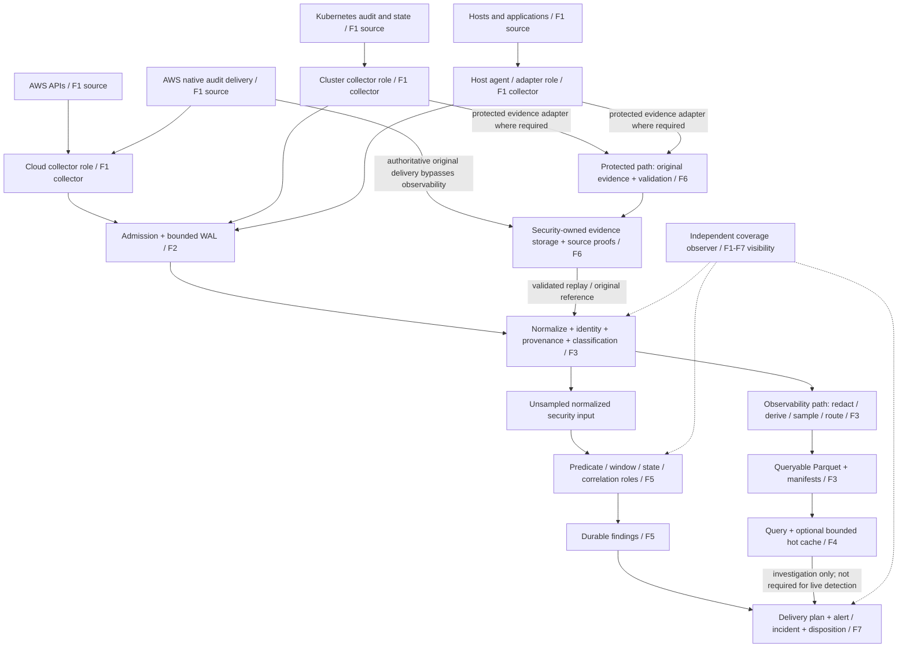

# Logical architecture and trust boundaries

Status: target responsibilities, 2026-10-07. Current implementation remains one
`signal-server`, a file/stdin `signal-agent`, the collector SDK and `signalctl`.
Read [source/detection requirements](source-detection-catalog.md) first and use
[failure domains](failure-domains.md) for acknowledgement/recovery semantics.
The [MVP](02-mvp.md) and [release audit](21-release-readiness.md) describe what
is implemented and qualified. This document introduces no new release claim.

## Responsibilities with failure domains overlaid

F3 includes the observability account as a shared dependency. F4/F5 are logical
roles but currently share its process, host, disk and permissions. Drawing them
separately does not make them independently available. F6 independence requires
separate delivery, administration and credentials as well as a separate account.
CloudTrail originals should reach security-owned storage through native delivery;
an observability gateway outage must not be their sole capture dependency.
The Kubernetes/host protected adapters and observer shown above are proposed.
The current agent has no second S3 output or source-level integrity protocol.

The diagram is a target routing view, not a prescription for serially archiving
every record before evaluating it. A finding carries its evidence milestone:
positive evidence may be detected promptly while independent archive validation
is pending. Pending or failed validation must remain visible to SecOps.

## Collection roles

| Role | Responsibility | Current boundary / next requirement |
| --- | --- | --- |
| Host agent | Local capture, timestamp/identity, bounded spool, retry and delivery acknowledgement | File/stdin exists; runtime hooks, boot/process identity and coverage reporting need new work |
| Cluster collector | Centralized Kubernetes audit/state discovery and metadata distribution | Proposed SDK consumer; use per-cluster ownership and bounded API watches/caches |
| Cloud collector | Account/region partitioned audit reads and configuration discovery | Post-MVP Phase 9; generic role-assumption/adapter mechanisms only in OSS |
| SaaS collector | Provider-specific API pagination, durable source receipts and scoped retry | Proposed; shared mechanisms with separate credentials and source coverage profiles |
| Admission/gateway | Authenticate sender, validate envelope/limits, bound concurrency, append synced WAL | Existing ingest role inside server; sender authentication alone does not prove resource identity |
| OTLP adapter | Convert supported OTel records into the canonical envelope | Proposed; logs first if selected; no metrics/traces platform implied |

Collectors provide original source identity and available context. Central roles
perform expensive parsing, enrichment and detection. Edge filtering applies only
to streams whose policy allows it, after any required protected evidence capture.
Provider configurations, actual IAM roles, account/cluster inventory, private
classifications and authorization decisions stay in the private application.
Separate modes or deployables are options after permission/scale evidence, not
an instruction to build one universal privileged binary.

The [ingestion audit](26-ingestion-architecture-audit.md) distinguishes host,
AWS, SaaS and gateway operational roles without requiring new binaries. A site
syslog gateway, Firehose receiver and canonical HTTP admission have different
framing and acknowledgement contracts; none is implied by the existing endpoint.

## Event identity, provenance and context

`signal-event` remains the canonical versioned envelope. New source metadata fits
inside nested attributes through the public SDK; no company fields enter its
top-level schema. Preserve source event ID, source event time, observed time,
collector identity/configuration revision, normalization revision and original
evidence reference. SourceCoverage is a separate versioned contract with pure SDK
validation/assessment. The separate bounded local
[`signal-coverage` library](../crates/signal-coverage/README.md) implements prepared
append/recovery, application-authorized intake, exact-byte receipt replay and
immutable correction admission. Pruning, scans, observers and server integration
remain planned; coverage receipts do not implement telemetry source receipts.
The event schema is unchanged.

Keep actor identity, affected resource identity and collector identity distinct.
An STS session may belong to one account and act on resources in another.
Authoritative account/resource claims need source/configuration verification;
the MVP Bearer token is not per-account attribution or tenant authorization.
An untrusted sender must not assign itself protected-stream priority or an asset
owner. Scope-sensitive claims come from a trusted, versioned mapping.

Use OTel semantic names where an actual adapter supports them. The fixture-only
`attributes.security.*` profile demonstrates predicates; it is not a competing
instrumentation standard or a completed production normalizer. Unknown/missing
fields stay unknown rather than gaining inferred success, MFA or approval values.

Topology is an optional bounded context provider: resource nodes and time-valid
relationships from declared configuration, cloud/Kubernetes APIs or traces. Each
edge records source, observation time, validity and confidence. Preserve historical
revisions when evaluating past events. A trace/flow edge supports an observed
relationship; it does not establish causation. No graph database or automatic RCA
is required by the initial predicates.

## Protected evidence and query copies

The protected path preserves authorized original evidence, source references,
configuration/coverage records and validation results. No intentional sampling
or eviction is permitted for a stream declared protected. The commitment is
bounded by capture preconditions, source retention and measured outage budgets;
see [failure domains](failure-domains.md#capacity-and-critical-stream-reserves).

Security-owned object storage needs separately authorized writers/readers and
retention administration. Proposed Object Lock/versioning provide object-version
retention controls. They do not authenticate a compromised producer, validate a
source signature or prove that every required source emitted a record. Source
proof validation and coverage remain separate. Keep KMS access/recovery and
deletion authority outside ordinary observability administration; choose policy
and test these permissions in an authorized environment.
[S3 Object Lock](https://docs.aws.amazon.com/AmazonS3/latest/userguide/object-lock.html),
[CloudTrail validation](https://docs.aws.amazon.com/awscloudtrail/latest/userguide/cloudtrail-log-file-validation-intro.html).

The observability path stores queryable normalized copies, potentially redacted,
sampled or shorter-lived. Existing storage is local Parquet. S3-backed Parquet,
bounded manifests and object-store query planning are proposed through `EventStore`.
Define object publication, manifest commit, duplicate identity and reader snapshot
semantics before replacing local filesystem guarantees. Do not require a hot
store or archive rehydration workflow in the logical contract; direct object-store
query acceptance needs its own measured latency/scan-cost budgets.

Detection receives unsampled normalized security input, independently of query
sampling. Input preprocessing may redact fields only if the detection profile
still has the evidence it requires. Findings reference evidence without copying
secrets into general query/notification payloads. Access to an evidence pointer
never grants access to the underlying object.

## Detection, delivery and SecOps feedback

The initial predicate engine is stateless. Window/state/correlation are future
capabilities derived from the catalog. They require bounded state, event-time
rules, revisioned inputs, duplicate handling and crash-consistent checkpoints.
Keep detection logic independent of collector implementation; a raw provider
payload is normalized by a source adapter before engine evaluation.

The target chain is original evidence → normalized event → assessment/security
signal → finding → alert/incident → disposition. Do not collapse these into one
event severity. Positive evidence, severity, confidence, coverage health and
evidence durability are separate fields of the future assessment/delivery contract.
The current Finding envelope is not silently extended here.

The [findings cursor proposal](25-findings-cursor-proposal.md) gives a bounded
public delivery seam; it is still unimplemented. Private consumers durably commit
the source cursor and delivery plan together, then retry destination-specific
notifications. A destination receipt differs from a local plan and from analyst
acknowledgement. Preserve duplicate suppression, uncertain delivery, routing
revision and dispositions. Automated remediation requires its own authorization;
a suggested runbook is not permission to execute it.

Disposition records should distinguish true positive, benign positive, false
positive and confirmed incident, with analyst, time, reason and rule revision.
Measure alert precision on reviewed cases and preserve unreviewed cases separately.
MTTD/MTTA/MTTR require defined start/end timestamps; counts of matched events are
not these measurements. Generic feedback contracts can be public; actual identity,
routing, severity thresholds and incident policy stay private.

## Evolution without premature service splits

1. Preserve and qualify the current MVP and hardened single-server deployment.
2. Add source normalization/coverage contracts and separately owned collectors.
3. Establish independent original-evidence delivery and validated recovery.
4. Add bounded delivery/state/window/correlation mechanisms one at a time.
5. Split query/detection/ingest only when measured contention, permissions,
   isolation or availability requirements justify separate ownership and fencing.

The [derived roadmap](04-implementation-plan.md#security-requirements-roadmap)
sequences these capabilities without renumbering historical phases or removing
open ARM64/EKS/remote-CI/released-dependency gates.
